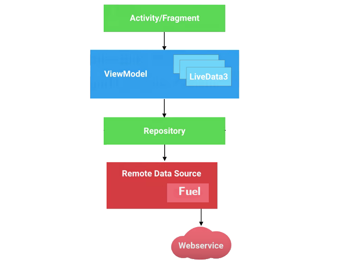

# Sport Results
A simple android app that demonstrates consuming nested Json object and displaying them in chronological order.

## Table of Content
- Description
- App architecture
- Libraries

### Description

This project consumes a nested json object using Retrofit 2 and Gson Libraries. The data is displayed in the recyclerview 

### App architecture

I used Android Architecture Components (AAC). It can solve problems with configuration changes, supports data persistence, reduces boilerplate code, helps to prevent memory leaks and simplifies async data loading into your UI.

### Libraries

Libraries used in the app are:

  - Retrofit - a type safe http client for android and java.
  - GSON - A Java serialization/deserialization library to convert Java Objects into JSON and back.
